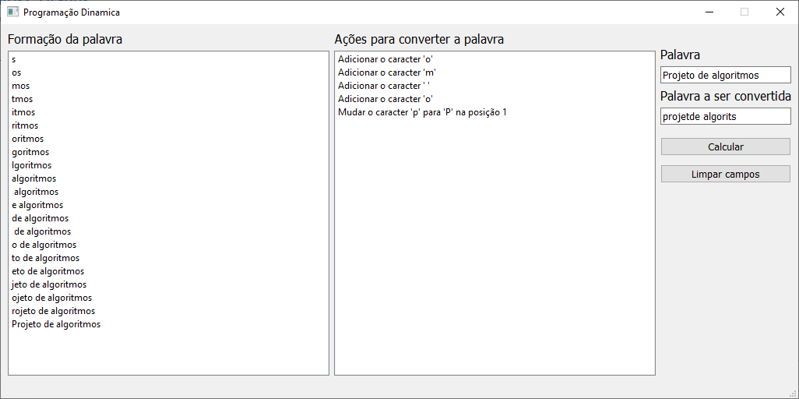

# Word Converter

**Número da Lista**: 5<br>
**Conteúdo da Disciplina**: Programação Dinâmica<br>

## Alunos
|Matrícula | Aluno |
| -- | -- |
| 16/0133505  |  Lucas Gomes Silva |
| 19/0134623  |  Marcos Diego da Silva Gomes |

## Sobre 
O projeto tem como objetivo utilizar o conceito de programação dinâmica, com o auxílio do algoritmo de Floyd Warshall, para gerar um algoritmo capaz de comparar palavras e demonstrar as mudanças necessárias para transformar uma ou mais palavras no padrão definido.

## Screenshots
#### Tela inicial

#### Opções

#### Resultado


## Instalação 
**Linguagem**: Python<br>
É necessário ter instalado o **Python** e o **pip** para executar o projeto (é recomendado utilizar um ambiente virtual para instalar e executar o projeto).

- Para instalar o gerenciador de pacotes pip:<br>
    ``` sudo apt-get install python3-pip ```
    
- Clone o repositório:<br>
    ``` git clone https://github.com/projeto-de-algoritmos/PD_WordConverter ```

- Instale as bibliotecas necessárias:<br>
    ``` pip install -r requirements.txt ```

## Uso 
### Para executar o projeto
Após estar dentro da pasta do projeto e com todas as bibliotecas instaladas, existe os seguintes passos para visualização do projeto: <br>
1. Entre na pasta do projeto pelo terminal e rode o seguinte comando no terminal: <br>
    ``` python main.py ```

### Como usar
1. No canto direito superior da tela digite a palavra desejada como resultado.
2. No campo inferior digite a palavra que deverá ser convertida.
3. Clique no botão "Calcular".
4. Será então apresentado nos campos ao lado esquerdo os passos realizados para a conversão da palavra e ao lado as ações necessárias.


